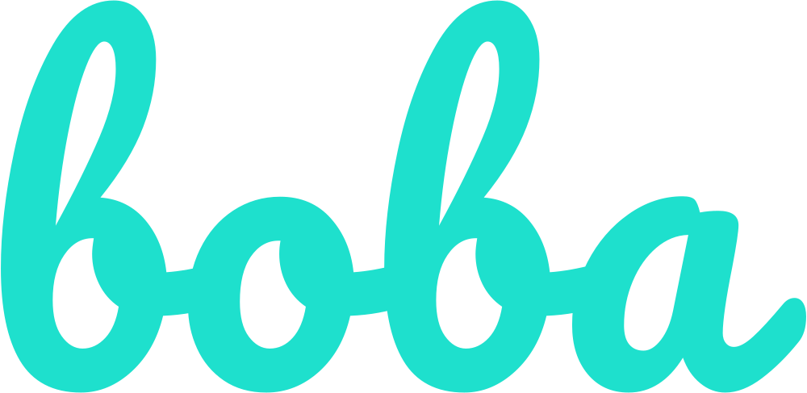

## Introduction
***
boba is a MERN stack webapp pre-built with login/register authentication module, and a basic Bootstrap user interface.
 
Pre-built functions include register, login, logout, changing password, deleting account, navigation, etc.
 

## Environment
***
To get this app to work, the necessary environment must be installed first. 
boba requires 
<ol>
  <li>Mongdb</li>
  <li>Node.js</li>
</ol>

## Setup
***
After setting up the environment, follow the steps below:
<ol>
  <li><strong>Under the project directory</strong>, run

    npm install

  </li>
  <li><strong>Go to client directory</strong>, run 
  
    npm install

  </li>
  <li>Make sure MongoDb is online, create a database {boba_db} use MongoDB Compass
  </li>
  <li>To start the application, run:
  
    npm run dev
  
  The webapp depend on your setups should automatically open your default browser and start the welcome page.
  </li>
</ol>

## License
***
boba is open-sourced software licensed under the MIT license.
